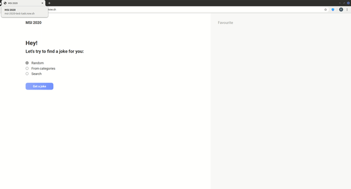
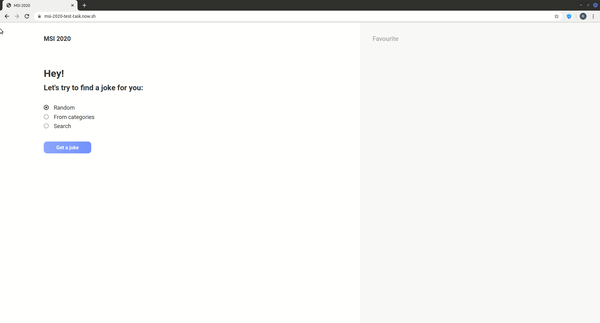
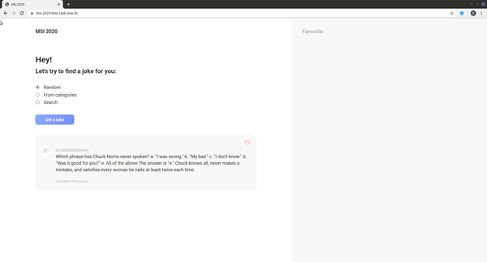
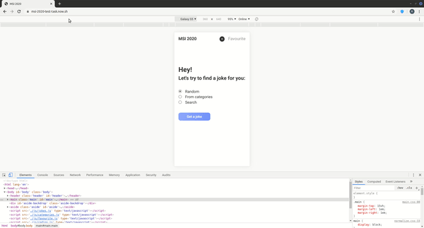
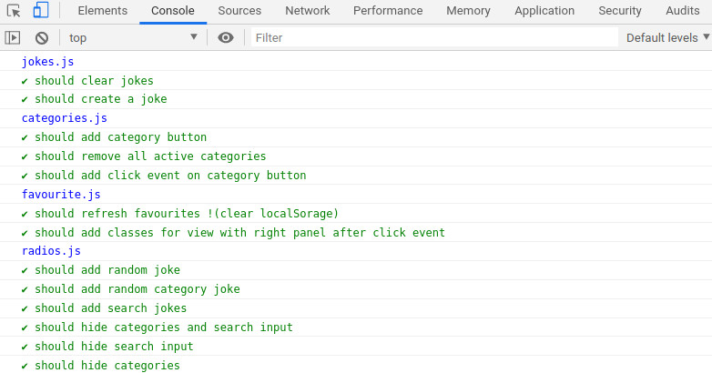

# Test task for Front-End Intern position

**_You can see an example of working application following this [link](https://msi-2020-test-task.now.sh/ "working application link")_**

**_React implementation is [here](https://react-msi-2020-test-task.now.sh/ "working react application link")_**

## Content

- [Features](#feaures)
- [Responsive design](#responsive-design)
- [Unit tests](#unit-tests)
- [Project structure](#project-structure)

## Features
### Ability to get a random joke
You can get a random joke by selecting _Random_ radiobutton and pushing _Get a joke_

### Ability to get a random joke from category
You can get a random joke from category by selecting _From categories_ radiobutton and pushing _Get a joke_

### Ability to get jokes by free text search
You can get jokes by free text search by selecting _Search_ radiobutton and filling search input. Then push _Get a joke_

### Any joke can be marked/unmarked as favourite
You can push a heart icon to add joke to favourite.

### Favourite jokes are stored in browser
Jokes are stored in browser using _localStorage_

## Responsive design
Application can be in 3 different states:
- Mobile
- Tablet
- Desktop

## Unit tests
Output of unit tests:

## Project structure

- [index.html](./index.html) _(main code)_
- [test.html](./test.html) _(unit tests)_
- **./css/** _(styles)_
- - [normalize.css](./css/normalize.css) _(css resets)_
- - [main.css](./css/main.css) _(all css is here)_
- **./js/** _(javascript)_
- - [categories.js](./js/categories.js) _(actions with categories)_
- - [favourite.js](./js/favourite.js) _(actions with favourite button)_
- - [jokes.js](./js/jokes.js) _(create and clear jokes)_
- - [main.js](./js/main.js) _(run main)_
- - [radios.js](./js/radios.js) _(actions with radiobuttons)_
- - **[test.js](./js/test.js)** _(unit tests)_
- ./icons/ _(icons)_
- ./media/ _(files for documentation)_
- [react-implementation](./react-implementation/)
---

_Made by [Ilienko Roman](https://ilienkors.com/)_